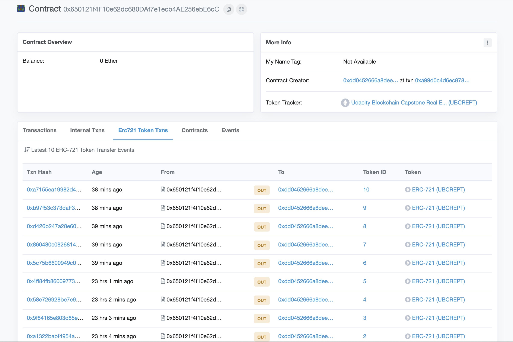
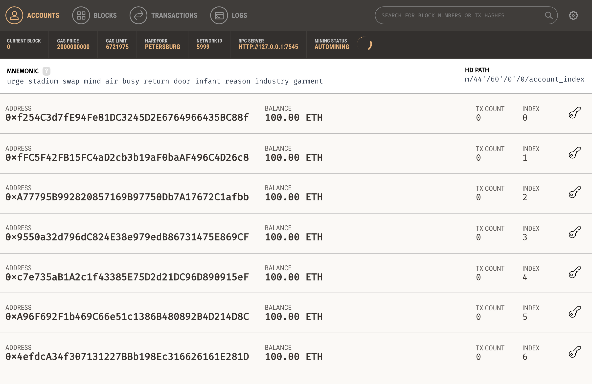
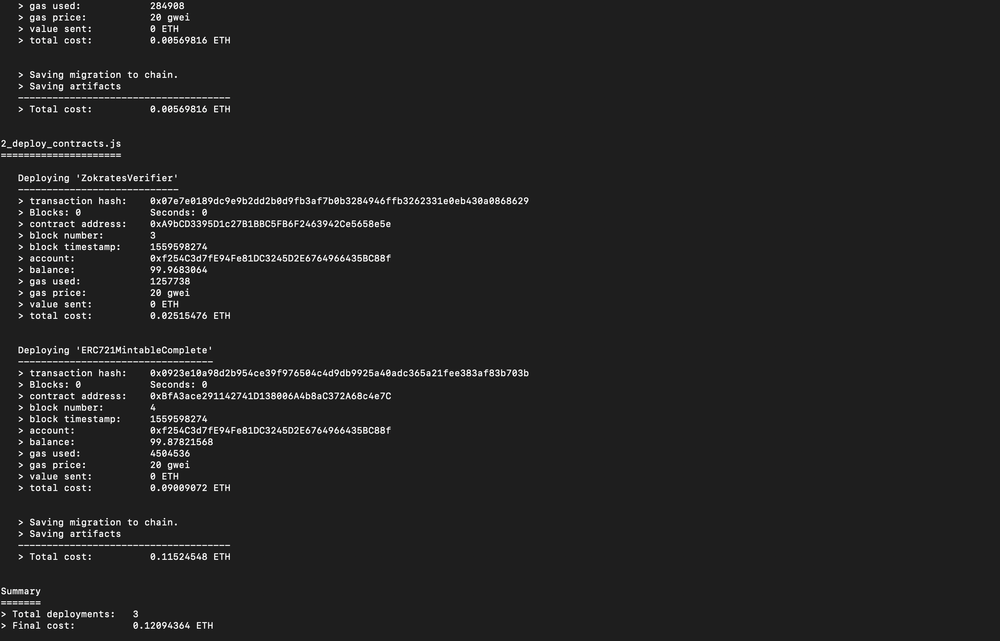
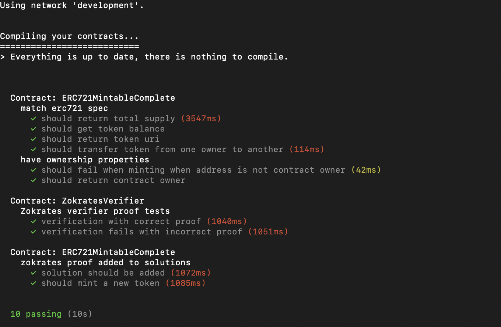
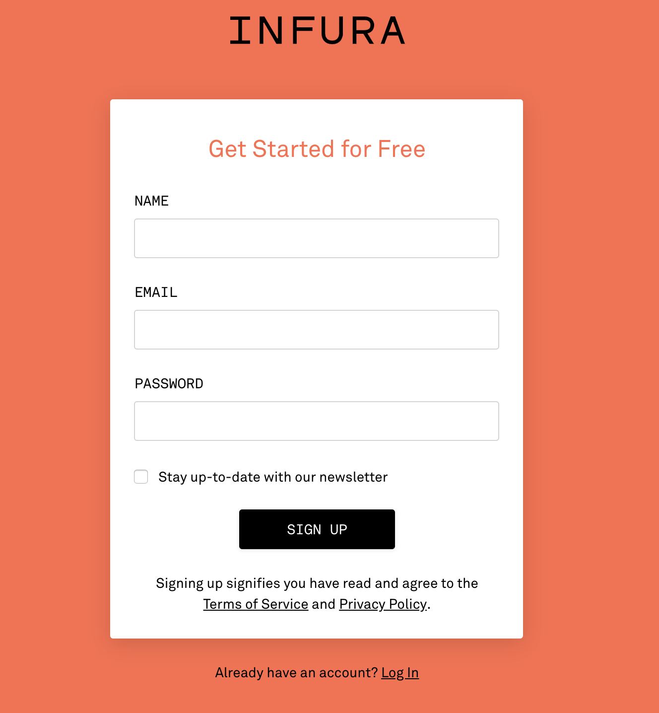
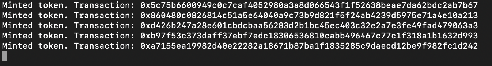
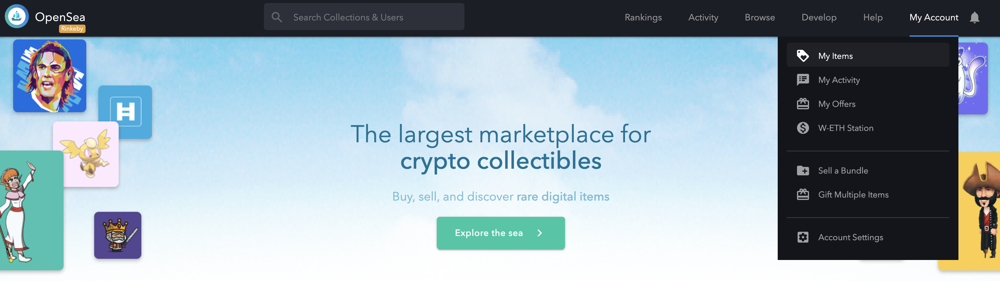
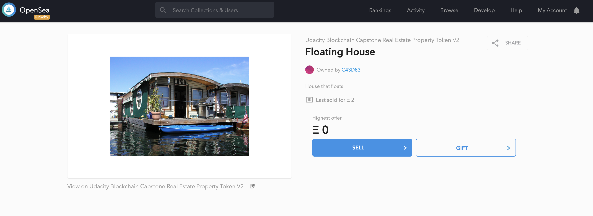

# Udacity Blockchain Capstone - Decentralized Real Estate Marketplace

This capstone project illustrates:
* how to create an ERC721, non-fungible token
* using a zk-SNARK proof to mint the ERC721 tokens
* and finally, how to "list" your tokens on OpenSea for purchase or auction

The zk-SNARK proof used in this project was created with Zokrates (see below in resources). The Zokrates proof and verification is
incorporated into the ERC721 contract to allow minting of the tokens.

For detailed information on Zokrates and how to create the proof and verification contract, see the [Official Zokrates documentation](https://zokrates.github.io/gettingstarted.html).

Once the tokens are minted you can use OpenSea to list them for sale. The Udacity capstone API has already been setup by Udacity 
with the required metadata for each token Id (Name, property image, etc.). After the tokens have been put up for sale on OpenSea,
you can use another Metamask account (for example) to purchase them.


## UBCREPT Contract Address

The ```Udacity Blockchain Capstone Real Estate Property Token``` (UBCREPT) has been deployed to the Rinkeby test network and has a 
contract address:

```
0x650121f4F10e62dc680DAf7e1ecb4AE256ebE6cC
```

View it on [rinkeby.etherscan.io](https://rinkeby.etherscan.io/address/0x650121f4F10e62dc680DAf7e1ecb4AE256ebE6cC#tokentxnsErc721).



## OpenSea Storefront

The OpenSea items created from the minted ERC721 tokens are viewable at:

* [UBCREPT Asset #1](https://rinkeby.opensea.io/assets/0x650121f4F10e62dc680DAf7e1ecb4AE256ebE6cC/1?)
* [UBCREPT Asset #2](https://rinkeby.opensea.io/assets/0x650121f4F10e62dc680DAf7e1ecb4AE256ebE6cC/2?)
* [UBCREPT Asset #3](https://rinkeby.opensea.io/assets/0x650121f4F10e62dc680DAf7e1ecb4AE256ebE6cC/3?)
* [UBCREPT Asset #4](https://rinkeby.opensea.io/assets/0x650121f4F10e62dc680DAf7e1ecb4AE256ebE6cC/4?)
* [UBCREPT Asset #5](https://rinkeby.opensea.io/assets/0x650121f4F10e62dc680DAf7e1ecb4AE256ebE6cC/5?)


## Getting Started

These instructions will get the project up and running in your local development environment so you can create your own NFT tokens and list them on the OpenSea Decentralized Marketplace.

### Prerequisites

Install Truffle and Ganache. 

```
npm install -g truffle@5.0.17
```


### Installing

Clone this repository:

```
git clone [repo]
```

Change directory to the ```blockchain-capstone``` folder and install all requisite npm packages (as listed in ```package.json```):

```
cd blockchain-capstone
npm install
```

Launch Ganache:




Compile and migrate smart contracts to the locally running blockchain (Ganache):

```
truffle migrate --reset
```



This will create the smart contract artifacts in the ```build/contracts``` folder, and will deploy the contracts to ```ganache```.


### Testing

Run the truffle tests. All should pass.

```
truffle test
```




## Deploying to the Rinkeby Network

1. You will need to sign-up for [Infura.io](https://infura.io), if you don't already have an account.



2. Create a project and save the Infura.io project key
3. Get the mnemonic for your Metamask wallet

Run the following export commands, substituting your ```infura project key``` and ```metamask``` seed phrase below:

```
export INFURA_KEY="<infura_project_key>"
export MNEMONIC="<metamask_seed_phrase>"
export NETWORK="rinkeby"
```

Deploy the contract to the Rinkeby network:

```
truffle deploy --network rinkeby
```

Take note of the ERC721MintableComplete contract address and the account owner address.

## Minting Tokens

Use the ```mint.js``` script to create 5 new NFTs. Run the following commands:

```
export OWNER_ADDRESS="<owner_account_address">
export NFT_CONTRACT_ADDRESS="<deployed_ERC721MintableComplete_contract_address>"
export NETWORK="rinkeby"
node scripts/mint.js
```




## Listing Your Tokens on OpeaSea

To list your tokens on the Rinkeby OpenSea network, open ```https://rinkeby.opensea.io``` using the Metamask account you used to mint the tokens.

Click on ```My Acccount``` and then ```My Items```.




From there you can click on one of the items to view the detail page, where you have the option to list it for sale (SELL button).




See [OpenSea Decentralizied Marketplace](https://docs.opensea.io/docs/getting-started) for more details on working with the platform to buy, sell, and auction NFT items.


# Project Resources

* [Remix - Solidity IDE](https://remix.ethereum.org/)
* [Visual Studio Code](https://code.visualstudio.com/)
* [Truffle Framework](https://truffleframework.com/)
* [Ganache - One Click Blockchain](https://truffleframework.com/ganache)
* [Open Zeppelin ](https://openzeppelin.org/)
* [Interactive zero knowledge 3-colorability demonstration](http://web.mit.edu/~ezyang/Public/graph/svg.html)
* [Docker](https://docs.docker.com/install/)
* [ZoKrates](https://github.com/Zokrates/ZoKrates)

## Packages

* web3js
* truffle
* truffle-assertions
* truffle-hdwallet-provider
* open-zeppelin

## Attribution

Adapted from the [Blockchain-Capstone](https://github.com/udacity/Blockchain-Capstone) project.

## Versions
* Truffle v5.0.17 (core: 5.0.16)
* Solidity v0.5.2 (solc-js)
* OpenZeppelin ^2.3.0
* Node v10.15.3
* Web3.js v1.0.0-beta.37
